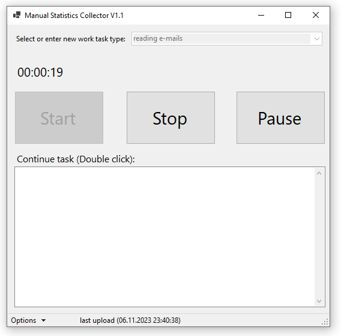

# ManStatCol - Manual Statistics Collector

ManStatCol is mainly a desktop application that enables users to log the time spent on specific tasks. This utility is aimed at providing a straightforward way for workers to log task durations, which are then continuously pushed to a central server using Azure Functions. The collected data is used to generate statistics for analysis, potentially informing decisions regarding the automation of repetitive tasks.

## Features 
 - Track time with Start/Stop
 - Pause tasks to continue later
 - Define and reuse task descriptions
 - Automatically upload new log entries
 - Desktop application works online and will upload data once online
 - Low-cost backend using Azure Functions

## License
 This work is licensed under a <a rel="license" href="http://creativecommons.org/licenses/by-nc-sa/4.0/">Creative Commons Attribution-NonCommercial-ShareAlike 4.0 International License</a> and [GNU GENERAL PUBLIC LICENSE version 3](https://www.gnu.org/licenses/gpl-3.0.en.html). If there are any contradictions between the two licenses, the Attribution-NonCommercial-ShareAlike 4.0 International license governs. 
